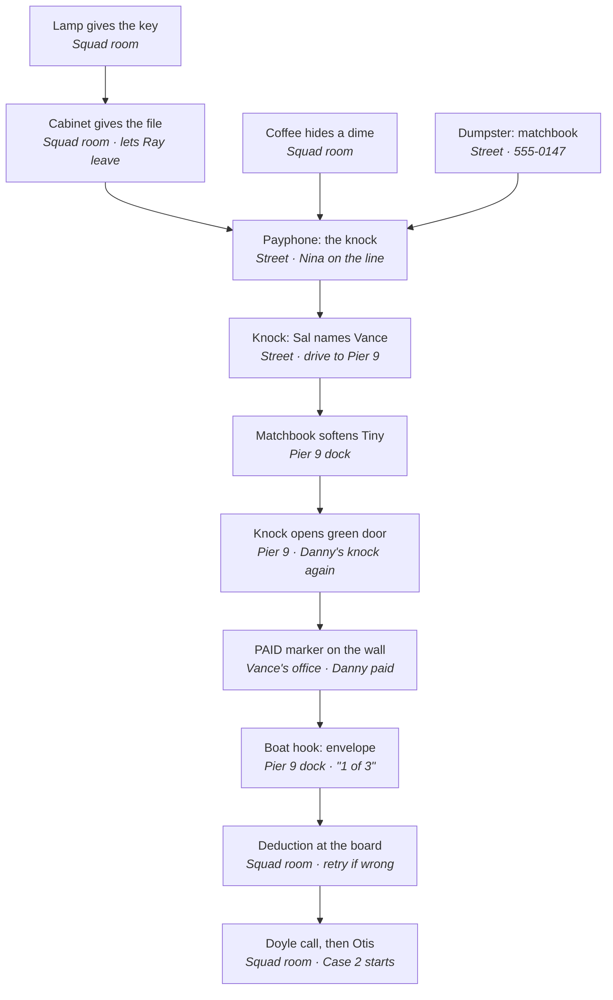

# Nightshift: Case 1 Script

Oct 3, 2026 · @Someone

## Overview

Case 1 runs from 12:15 to 1:30 a.m., about 35 minutes of play, and ends with Danny's case still open: Ray proves Danny Reyes was killed for something he had, not for money he owed. It doubles as the tutorial, so every verb, the inventory, item-on-hotspot, dialogue choices and the deduction board are introduced here.

**Premise.** Danny Reyes, 34, piano player at the Blue Note, was shot once with a .38 in the alley beside the club two nights ago. His wallet was still on him; his phone was never found. Lt. Doyle wants it closed by Friday as a debt killing. Ray follows the debt to Vance, a loan shark at Pier 9, and finds out Danny paid him off in full the week he died.

**Flow.** Squad room (file, key, dime) → street outside the Blue Note (matchbook, payphone call to Nina, the knock, Sal through the door) → drive to the port → Pier 9 dock (the doorman, Tiny) → Vance's office (interrogation, the PAID marker) → back on the dock (the envelope in the burn barrel) → drive back → squad room (deduction at the murder board, the call to Doyle, the desk phone rings with Case 2).

**Case 1 puzzle chain · 12 steps** (every Case 1 puzzle leads to the envelope and the board)

The case is one linear chain with one side branch (the dime). The matchbook and Danny's knock are each used twice, once on the street and again at Pier 9.

**Locations.**

| Location | Status | Notes |
| --- | --- | --- |
| Squad room, Room 214 | Exists | Hub. Gains the deduction board interaction and a voicemail on the desk phone. |
| Street outside the Blue Note | Exists | Car becomes usable after Sal. One new look-only hotspot (rezoning notice). |
| Pier 9 dock | New | Night, rain, sodium light, stacked containers, the warehouse with the green door, a burn barrel. |
| Vance's office | New | A shipping container fitted out as an office inside the warehouse. One screen. |

**Cast in this case.**

| Character | Where | Voice and manner |
| --- | --- | --- |
| Ray Kessler | Everywhere | Dry, tired, precise. Gentle with witnesses, sarcastic with power. |
| Lt. Maureen Doyle | Voicemail and phone | Clipped, political, not unkind. Wants it closed. |
| Nina Alvarez | Payphone (voice only) | Guarded, grieving, quick. Danny's girlfriend. |
| Sal Moretti | Through the Blue Note door (voice only) | Gravel, short sentences, scared and hiding it. |
| "Tiny" Ruiz | Pier 9 dock | Vance's doorman. Enormous, soft-spoken, misses Danny's playing. New character. |
| Vance | Vance's office | Loan shark, sixties, cardigan over a shoulder holster. Courteous and cold. |
| Sgt. Otis Bell | Desk phone, last scene | Warm, funny, tired. Delivers Case 2. |

**How to read this script.** Scenes are written screenplay style: **CHARACTER:** for spoken lines, italics for action and stage directions, and `[choice]` blocks for dialogue menus. Under each scene a table lists every hotspot with its Look and Use responses and any item use. Anything marked *existing* is already in the slice and is kept word for word unless the note says it changes. Wrong item uses not listed fall back to the room's default response.

## Clues and items

Case 1 has 8 inventory items and 6 notebook clues. Items are things Ray carries; clues are facts Ray writes in his notebook, stored as flags, and both can be picked as evidence on the deduction board.

**Inventory items**

| Item id | Name | Where found | How | Used for | Status |
| --- | --- | --- | --- | --- | --- |
| `key` | small key | Squad room, under the desk lamp | Use the lamp | Opens the filing cabinet | Existing |
| `case_file` | Reyes file | Squad room, filing cabinet | Use the key on the cabinet | Needed to leave the squad room; read it for clues | Existing, examine text extended |
| `coffee` | cold coffee | Squad room, desk | Pick up the mug | Pour into the wastebasket | Existing |
| `dime` | dime | Bottom of the coffee mug | Use the coffee on the wastebasket | Use on the payphone | Existing |
| `matchbook` | matchbook | Street, dumpster at the alley mouth | Use the dumpster | The number 555-0147; show to Tiny at Pier 9 | Existing |
| `gaff` | boat hook | Pier 9 dock, hanging on a piling | Use the piling | Fish the envelope out of the burn barrel | New |
| `envelope` | Blue Note envelope | Pier 9 dock, burn barrel | Use the boat hook on the barrel | Key evidence; pinned to the murder board | New, required seed |
| `notebook` | Ray's notebook | Always in inventory | Given at game start | Examine to review clues | New, optional UI convenience |

**Notebook clues**

| Clue flag | Notebook line | Where learned | How |
| --- | --- | --- | --- |
| `clue_wallet_phone` | Wallet left on the body. Phone never found. | Reyes file | Examine the file in the inventory |
| `clue_38` | Shot once, .38, close range. | Reyes file | Examine the file in the inventory |
| `clue_knock` | Danny's knock: two slow, three fast. Nina gave it to me. | Payphone call | Ask Nina how to get Sal to open up |
| `clue_vance` | Vance. Pier 9. Green door. | Sal, through the door | Ask who Danny owed money to |
| `clue_paid` | Danny paid Vance $8,000 in full, cash, Tuesday afternoon. He was shot that night. | Vance's office | Ask Vance about the PAID marker |
| `clue_alibi` | Vance was on his boat in Avalon the night Danny died. | Vance's office | Ask Vance where he was Tuesday night |

The envelope is the only board item from this case that carries forward as required. Everything else stays in the notebook and is referenced again in Case 5.

## Script

Seven scenes. Scenes 1 and 2 extend the existing slice; scenes 3 to 7 are new.

### Scene 1. The squad room (12:15 a.m.)

*Goal: get the Reyes file and a dime. Teaches look, use, pick up, item on hotspot, and examining items.*

**INT. HOLLYWOOD HOMICIDE, ROOM 214. NIGHT.**

*Rain on the window. A radiator clanks. The desk phone's message light blinks red. Ray stands by his desk, raincoat on.*

**RAY:** Quarter past midnight. The squad room is mine again. *(existing)*

**RAY:** Danny Reyes. Two nights cold, and the lieutenant wants it closed by Friday. *(existing)*

**RAY:** First, the file. I locked it away like a careful man. *(existing)*

**RAY:** Then I hid the key like a paranoid one. *(existing)*

*Control returns to the player. The cursor hint "Right click to look, left click to use" fades in once, then away.*

**Desk phone voicemail (new, optional).** *Ray presses the blinking button. The speaker crackles.*

**DOYLE (V.O., recording):** Ray, it's Doyle. Eleven-forty. I've got the captain asking about Reyes. It's a gambling debt and a .38 in an alley, it's not the Black Dahlia. Get me a name by Friday. *(beat)* And answer your cell once in a while.

**RAY:** My cell is in my coat. My coat is wet. We all have problems.

**Reading the file (extended).** *Right click the Reyes file in the inventory. Ray flips it open.*

**RAY:** Daniel "Danny" Reyes, 34. Piano player at the Blue Note. *(existing)*

**RAY:** Found in the alley next to the club, two nights ago. Wallet still on him. *(existing)*

**RAY:** One shot, a .38, close enough to leave powder on his shirt. *(new; sets* `clue_38`*)*

**RAY:** No phone. A musician without a phone. The uniforms looked everywhere but the right place. *(new; sets* `clue_wallet_phone`*)*

**RAY:** The bartender, Sal Moretti, told the uniforms he saw nothing. *(existing)*

**RAY:** Sal sees everything. That's his job. *(existing)*

*A notebook toast appears: "Notebook updated." (first time only, teaches the notebook).*

**Puzzle 1.1: The file.** Look at the lamp ("The base sits a little crooked"), use the lamp to get the key, use the key on the filing cabinet to get the file. The door refuses to open without the file: "Not without the Reyes file."

**Puzzle 1.2: The dime (needed in Scene 2).** Pick up the mug (cold coffee), use the coffee on the wastebasket, a dime is left at the bottom. If the player leaves without it, the payphone in Scene 2 says "It wants a dime," and Ray adds "There's always loose change back in the squad room. Usually at the bottom of something."

| Hotspot | Look | Use | Item use | Status |
| --- | --- | --- | --- | --- |
| Door | "HOMICIDE. Room 214. Home sweet home." | Without file: "Not without the Reyes file." With file: "Let's go see what the Blue Note didn't see." Exits to the street. | "The door's not locked. My problems are." | Existing |
| Coat rack | "My raincoat. Twenty years old and it still leaks at the collar." | "It's raining out. I'll be wet either way." | Default | Existing |
| Murder board | "The murder board. Every case up there has a name. Most have a face." / "Reyes is the one in the middle. String leads to the Blue Note." | Same as look until Scene 7, then opens the deduction | Before Scene 7: "Pinning that up won't solve anything." | Existing, gains Scene 7 |
| Desk lamp | "Green banker's lamp. Older than half the squad." + "The base sits a little crooked." (until key taken) | Gives `key`: "Old habit. Tape a key under the lamp base, where nobody looks." Then: "Nothing else under there but dust." | Default | Existing |
| Computer | "Department computer. It takes four passwords to tell me nothing." | "Reyes, Daniel. No priors, no warrants, no next of kin who'll pick up." / "The report can wait. The report can always wait." | Default | Existing |
| Desk phone | "The desk phone. It only rings when someone's dead." + "The message light is blinking." (until played) | Plays Doyle's voicemail once, then: "Nobody I want to call at this hour." | Default | Voicemail new |
| Mug | "My coffee. Made at six. It's past midnight now." | "Waste not." Gives `coffee`. | Default | Existing |
| Desk | "My desk. Government issue, scarred by three chiefs and a budget freeze." | "Old reports and older sandwiches. Nothing for Reyes." | Default | Existing |
| Wastebasket | "The wastebasket. Where most of my theories end up." | "I'm not digging through that again." | `coffee`: "Down the hatch. Somebody else's hatch." / "Well. There's a dime at the bottom of the mug." Gives `dime`. | Existing |
| Filing cabinet | Locked: "The filing cabinet. Locked. I keep the key somewhere clever." Open: "Open files and closed cases. Should be the other way around." | Locked: "Locked. I'm the one who locked it, too." Open: "I've got what I need from it." | `key`: "Second drawer. Reyes, Daniel." Gives `case_file`. | Existing |
| Window | "Four million people out there. One of them killed Danny Reyes." | "Painted shut. The blinds are the only thing in here that opens." | Default | Existing |
| Clock | "Twelve-fifteen. The city's second shift." | Same | Default | Existing |
| Radiator | "It clanks all night, like a drunk in the cells." | "Hot enough to brand a man. I'll pass." | Default | Existing |
| Coffee machine | "The squad's coffee machine. It makes something brown and hot. Usually." | "Out of filters since March. Nobody's filed the requisition." | `coffee`: "Reheating it won't make it coffee." | Existing |

## Deduction board

The player answers one question, then pins two pieces of evidence: "Why was Danny killed?" → "For something he had" + the envelope "1 of 3" + "Wallet left, phone gone." A wrong pick gets a line from Ray and the player picks again, with no penalty and no limit.

**Step 1. The question.** *The board zooms in on Danny's photo. Ray's voice:* "Two nights, one bullet, one piano player. Why?"

| Answer | Result | Ray's line |
| --- | --- | --- |
| Over the money he owed Vance | Wrong, retry | With `clue_paid`: "Vance doesn't shoot paying customers, and Danny had paid." Without it: "I haven't proved that. Doyle would love it if I had." |
| A street robbery gone wrong | Wrong, retry | "A robber who leaves the wallet. Worst robber in Hollywood." |
| For something he had | Correct, go to step 2 | "Not what he owed. What he had." |

**Step 2. The evidence.** The player picks two cards from everything in the notebook and inventory. Cards the player hasn't found don't appear, so the deduction is only reachable once `got_envelope` is set (the car won't leave Pier 9 without it).

| Evidence card | Source | Correct? | Ray's line when picked wrongly |
| --- | --- | --- | --- |
| Envelope, "1 of 3" | Item | Yes |  |
| Wallet left, phone gone | Reyes file | Yes |  |
| Paid in full, $8,000 | Vance | No, near miss | "That says he had money. What says there was more coming, and what the killer wanted instead?" |
| Shot once, .38, close range | Reyes file | No | "The gun tells me how. I need why." |
| Vance was in Avalon | Vance | No | "That clears Vance. It doesn't tell me why Danny died." |
| Danny's knock | Nina | No | "That's how I got through a door, not why he's dead." |
| Vance, Pier 9, green door | Sal | No | "That's where I went, not what I found." |
| Matchbook, 555-0147 | Item | No | "A phone number. Nina's, it turns out. Not a motive." |

If one of the two picks is right, Ray says the line for the wrong one and keeps the right card pinned so the player only replaces one. After three wrong submissions Ray adds a nudge: "Think, Ray. What did the killer leave behind, and what did he take? And who still owed Danny?"

**Success.** Plays the Scene 7 success beat: the envelope is pinned next to Danny's photo, a red string runs to an index card with a question mark, and `case1_deduced` and `board_envelope` are set.

## Seeds for later cases

Case 1 plants one required board item (the envelope) and eight quiet setups for Cases 4 and 5. None of the three optional seeds for the Doyle ending come from Case 1; those are in Cases 2, 3 and 4, and all three are required for that ending.

| Seed | Planted in | Flag | Pays off in |
| --- | --- | --- | --- |
| Envelope "1 of 3" on the board | Scene 6, pinned in Scene 7 | `board_envelope` | Case 5: the recording reveals Danny's blackmail, and the $8,000 was the first of three payments. Required. |
| Danny's phone is missing, wallet left | Scene 1, the file | `clue_wallet_phone` | Case 4: Ray finds the phone in the LA River. Case 5: the cloud backup holds the recording. |
| Only Ray, Nina and Sal know the knock | Scene 2, Sal's last lines | `talked_to_sal` | Case 5: no forced entry at the Blue Note; whoever killed Sal knew the knock. |
| Ray tells Doyle about Sal, Nina and the knock at 1:30 a.m. | Scene 7, the call | `told_doyle` | Case 5: Ray's call log shows Doyle was the only person he told. The leak. |
| "Thanks, Walt. Black is fine." | Scene 7, Doyle's aside | `told_doyle` | Case 5: Brenner was in Doyle's office "dropping off coffee" and used her desk line to call Nina. Ray can recall the line in the finale. |
| Ray met Nina on the phone | Scene 2, optional | `met_nina` | Case 5: Nina recognizes his voice in the cooler ("You're the one from the payphone"). Without it she needs one more line of persuading. |
| A man "who talked like a cop who'd stopped being one" called Vance | Scene 5, optional | `heard_caller` | Case 4: echoes Preacher's "big man in an old cop's coat." Case 5: Ray can ask Vance at Pier 9 if Brenner's voice is the one. Flavor only, not a board seed. |
| Vance and Tiny at Pier 9 | Scenes 4 and 5 | `case1_done` | Case 5: the finale is on Vance's pier; Vance is the witness. Tiny gets his answer ("You said you'd tell me"). |
| Rezoning notice, Pryce Development | Scene 2, optional | `saw_rezoning` | Cases 3 to 5: Pryce's name keeps turning up. In Case 5 Ray says "Pryce Development. It was taped to the Blue Note's wall the whole time." |
| Maya's text | Scene 3 | none | The final scene's "you up?" / "Always." |

**Continuity facts set by this script** (for later threads): Danny was shot Tuesday night around midnight; he paid Vance Tuesday afternoon; tonight is Thursday into Friday; Vance was in Avalon Tuesday night; the payphone number 555-0147 reaches Nina; Tiny Ruiz is Vance's doorman and a Blue Note regular.

## Implementation notes

Building Case 1 on the existing Godot slice needs two new rooms, two new characters, two new items, and three small systems (notebook, deduction board, scripted phone calls). Everything else reuses the current `main.*` scripting API.

**New content**

| What | Where | Notes |
| --- | --- | --- |
| Room `pier9_dock` | `tools/r3/pier9_dock.py`, `scripts/rooms/pier9_dock.gd` | New 3D set: containers, crane, warehouse with green door, awning, burn barrel, piling, car. Spawns: `street` (car), `vance_office` (green door). |
| Room `vance_office` | `tools/r3/vance_office.py`, `scripts/rooms/vance_office.gd` | One screen inside a container. Spawn: `pier9_dock`. |
| Characters Tiny and Vance | `tools/r3/` character rigs | Idle and talk loops are enough. Nina, Sal, Doyle, Otis and Maya stay off-screen and use `main.voice()`. |
| Items `gaff`, `envelope` | `Game.ITEMS`, `assets/items/*.png` | 28×28 icons. Envelope examine text is in Scene 6. |
| Rezoning notice hotspot | `tools/r3/street.py`, `textures.py` | A small paper notice on the Blue Note wall. |
| Street changes | `scripts/rooms/street.gd` | Rename the phone voice to Nina, add the new branches, remove `end_demo()`, make the car drive to Pier 9. |
| Squad room changes | `scripts/rooms/squad_room.gd` | Voicemail, Scene 7 state for board, phone and door. |
| Reyes file text | `main.gd` `examine_item()` | Two new lines and the two clue flags. |

**New systems**

- **Notebook.** Clues are flags with a `clue_` prefix and a line of text. A notebook item (or a key) lists them. A toast "Notebook updated" appears the first time.
- **Deduction board.** A full-screen UI: one question with three answers, then two evidence slots filled from found items and `clue_` flags. Wrong picks play Ray's line and let the player retry. Reusable for Cases 2 to 5, which use culprit + two evidence.
- **Transitions and texts.** A drive scene (looping rain-on-windshield art), a text-message bubble for Maya, and a title card for "1:40 a.m. Case 2: Five Stars."

**Flags set in Case 1**, in order: `read_file`, `clue_38`, `clue_wallet_phone`, `got_key`, `cabinet_open`, `took_mug`, `found_dime`, `got_matchbook`, `met_nina`, `knows_knock`, `clue_knock`, `talked_to_sal`, `clue_vance`, `saw_rezoning`, `tiny_softened`, `in_vance_office`, `saw_gun`, `clue_alibi`, `saw_paid`, `clue_paid`, `knows_envelope`, `heard_caller`, `got_envelope`, `case1_deduced`, `board_envelope`, `told_doyle`, `case1_done`. The existing `demo_done` flag is retired.

**Speech colors.** Ray white (existing), Sal pink (existing), Nina green (the existing phone color), Doyle pale blue, Otis warm yellow, Tiny tan, Vance gray-violet.

**Playtime estimate.** Scene 1 about 6 minutes, Scene 2 about 8, Pier 9 and Vance about 14, the return and deduction about 6, plus transitions: about 35 minutes for a first-time player, matching the outline.

### Scene 2. The street outside the Blue Note (12:25 a.m.)

*Goal: find the number, learn the knock, get Sal to talk. Teaches dialogue choices and that the order of questions matters.*

**EXT. STREET OUTSIDE THE PRECINCT. NIGHT. RAIN.**

*Sodium light. Across the street the Blue Note's neon stutters. Chairs on tables behind the window, one silhouette at the bar.*

**RAY:** Rain. Of course it's raining. *(existing)*

**RAY:** The Blue Note's across the street. Lights are off, but somebody's home. *(existing)*

**Puzzle 2.1: The number.** Look at the dumpster ("Something blue is caught under the lid"), use it to get the matchbook with 555-0147 written inside. *(existing)*

**Puzzle 2.2: The payphone call.** Use the dime on the payphone. Without the matchbook: "A dime's no good without a number to call." *(existing)*

*Ray drops the dime and dials.*

**RAY:** 555-0147...

**NINA (V.O., phone):** ...Yeah?

`[choice]` Is this Sal? / I'm calling about Danny Reyes. / Wrong number. Sorry.

- **Is this Sal?**
  - **NINA:** Sal don't take calls. Who's asking? *(returns to the menu)*
- **I'm calling about Danny Reyes.**
  - **NINA:** ...Danny was a good kid. Owed the wrong people.
  - **NINA:** You a friend of his?
  - `[choice]` Who am I talking to? / How do I get Sal to open the door? / Never mind.
    - **Who am I talking to?** *(new)*
      - **NINA:** Nina. I wait tables at the Note. Waited. *(beat)* I was his girl. Whatever that means now.
      - **RAY:** I'm sorry, Nina. Ray Kessler. I work Homicide.
      - **NINA:** Then you're two days late, Ray Kessler. *(returns to the menu without this option; sets* `met_nina`*)*
    - **How do I get Sal to open the door?**
      - **NINA:** Friends of Danny knock like Danny played. Two slow, three fast.
      - If `met_nina`: **NINA:** Sal's scared, Detective. Don't make me sorry I told you.
      - *Click.*
      - **RAY:** Two slow, three fast. Like a piano man. *(sets* `knows_knock`*,* `clue_knock`*)*
    - **Never mind.** *Click.* The phone returns the dime.
- **Wrong number. Sorry.**
  - *Click.*
  - **RAY:** There goes my dime. I'll need another one.
  - **RAY:** ...Actually, I won't. I'm not paying twice for that kind of manners.
  - **RAY:** The phone coughs my dime back up. Small mercies. *(the player can call again)*

*Design note: the call can't be lost. If the knock wasn't learned the dime always comes back.*

**Puzzle 2.3: The knock.** Use the Blue Note door. Before the call: "*knock knock*" / "Nothing. Whoever's in there isn't expecting company. Not my kind." After the call, Ray knocks two slow, three fast and Sal answers through the door.

**RAY:** *(knocking)* Knock... knock... knockknockknock.

**SAL (V.O., through the door):** ...Danny's knock. Who is this?

`[choice]` Police. Open the door, Sal. / A friend of Danny's. / Who did Danny owe money to? / Did you see who shot him? *(new)*

- **Police. Open the door, Sal.**
  - **SAL:** Cops don't know that knock. Somebody gave it to you.
  - **SAL:** Door stays shut. Talk through it.
- **A friend of Danny's.**
  - **SAL:** Danny didn't have friends. He had a piano and a tab.
- **Did you see who shot him?** *(new)*
  - **SAL:** I was counting the till. One shot. When I looked out the back, there was only Danny and the rain.
  - **RAY:** You told the uniforms you didn't hear anything.
  - **SAL:** I told the uniforms what they wanted to write down.
- **Who did Danny owe money to?** *(ends the conversation)*
  - **SAL:** ...
  - **SAL:** A man named Vance. Vance doesn't send letters, if you follow me.
  - **RAY:** Where do I find Vance?
  - **SAL:** Pier 9. Warehouse with the green door.
  - **SAL:** Who gave you the knock? *(beat)* Nina. Had to be. *(new)*
  - **SAL:** Three people alive know that knock now. Her, me, and you. Keep it that way. *(new, Case 5 seed)*
  - **SAL:** And you didn't hear it from me. You never heard me at all.
  - *Ray writes in his notebook.*
  - **RAY:** Pier 9. Vance. Green door. *(sets* `talked_to_sal`*,* `clue_vance`*)*
  - **RAY:** Sal saw something after all. They always do.

*Change from the slice: the call to* `end_demo()` *is removed. The car becomes the way forward.*

**Puzzle 2.4: Leaving.** Use the car. Before Sal: "Not leaving until I've talked to Sal." *(existing)* After Sal: "Pier 9. San Pedro. Forty minutes if the 110 behaves." Goes to Scene 3.

| Hotspot | Look | Use | Item use | Status |
| --- | --- | --- | --- | --- |
| Precinct door | "The precinct. Coffee's worse than the company." | Back to the squad room | Default | Existing |
| Blue Note door | "The Blue Note. Door's locked. The light inside says somebody's home." | Knock (see Puzzle 2.3). After Sal: "Sal's said all he's going to say." | "I'd rather knock." | Existing, after-Sal line kept |
| Neon sign | "BLUE NOTE. Live jazz Thursdays. Dead piano player Tuesday." | Same | Default | Existing |
| Payphone | "A payphone. Ten cents buys you thirty seconds of somebody's attention." Second look: "The last payphone in Hollywood. Somebody keeps paying the bill on it, and I'd like to know why." | No dime: "Dial tone. It wants a dime." After the knock: "I've made my call." | `dime`: the call. Other items: "It takes dimes. Only dimes." | Existing, second look new |
| Dumpster | "A dumpster at the mouth of the alley, where they found Danny." + "Something blue is caught under the lid." | Gives `matchbook`: "A matchbook from the Blue Note. Wet, but readable." / "There's a phone number written inside. In a hurry." Then: "Just garbage now. The uniforms missed the good stuff." | Default | Existing |
| Alley | "Where Danny Reyes stopped being a piano player and started being a case." | Same | Default | Existing |
| Rezoning notice | "NOTICE OF PUBLIC HEARING. Zone change, 6400 block. Applicant: Pryce Development." | "Somebody wants to build something. In this town somebody always does." Sets `saw_rezoning`. | Default | New, needs a hotspot on the Blue Note wall |
| Streetlamp | "Sodium light. Makes everybody look guilty. Saves time." | Same | Default | Existing |
| Car | "My car. Unmarked, if you don't count the dents." | See Puzzle 2.4 | Default | Existing, after-Sal use new |
| Hydrant | "A fire hydrant. Ticket bait." | Same | Default | Existing |
| Billboard | "SUNSET INJURY LAW. In this town even the lawyers work the night shift." | Same | Default | Existing |
| Precinct sign | "POLICE. They put it in big letters in case anyone forgets." | Same | Default | Existing |
| Bar window | "Lights on, chairs up, one silhouette at the bar. Closed, they'd tell you." | "Tapping on the glass gets you a look, not an answer." | Default | Existing |

### Scene 3. The drive south (12:45 a.m.)

*A non-interactive transition: rain on the windshield, wipers, the 110 freeway lights sliding past. About 20 seconds, skippable.*

**RAY (V.O.):** The 110 at one in the morning. Trucks, cabs, and people who don't want to go home.

*Ray's phone buzzes on the dashboard. A text bubble appears.*

**MAYA (text):** is it raining there too

**RAY (typing):** It's LA. It only rains when I'm working.

**MAYA (text):** so always

**RAY (V.O.):** She's got her mother's timing. And my hours.

*Cut to Pier 9.*

### Scene 4. Pier 9 dock (1:00 a.m.)

*Goal: get past Tiny. Teaches that items can be shown to people, and that the knock is a reusable piece of knowledge.*

**EXT. PIER 9, PORT OF LOS ANGELES. NIGHT. RAIN.**

*Stacked containers, a gantry crane with red lights blinking at the top. A corrugated warehouse with a green steel door. Under a dripping awning, TINY RUIZ sits on a folding chair with a transistor radio playing late-night jazz. A burn barrel smolders in the rain. A boat hook hangs on a piling at the water's edge. Ray's car is parked at the left.*

**RAY:** Pier 9. The ocean smells like diesel and money.

**RAY:** Green door. And a man the size of the door in front of it.

**Talking to Tiny.**

**TINY:** We're closed.

**RAY:** I didn't see a sign.

**TINY:** I'm the sign.

`[choice]` I need to see Vance. / LAPD. *(badge)* / Nice radio. / Never mind.

- **I need to see Vance.**
  - **TINY:** Mr. Vance doesn't see people at night. Mr. Vance doesn't see people in the day, either.
- **LAPD.** *Ray shows his badge.*
  - **TINY:** A badge gets you a lawyer, not a door. Come back with paper.
- **Nice radio.**
  - **TINY:** KJAZZ. Only station that still plays piano after midnight.
  - **TINY:** *(beat)* Used to be I didn't need a radio for that.
- **Never mind.** *Ends the conversation.*

**Puzzle 4.1: Who Tiny is.** Look at Tiny to see the hint: "Six-five, maybe more. Built like a vending machine. There's a Blue Note cocktail napkin folded in his breast pocket." Use the matchbook on Tiny.

**RAY:** You drink at the Blue Note.

*Tiny looks at the matchbook a long time.*

**TINY:** Thursdays. Kid used to play "'Round Midnight" for me without me asking.

**TINY:** Danny. Somebody put him down in that alley like a dog.

**RAY:** That's why I'm here.

**TINY:** Still can't let you in. Mr. Vance only opens up for people who've been here before.

**RAY:** *(to himself)* People who've been here before. People who knock like they've been here before. *(sets* `tiny_softened`*)*

**Puzzle 4.2: The knock again.** Use the green door.

- Before `tiny_softened`: Tiny stands. **TINY:** Knock on that door and you'll be knocking with your teeth. Ray steps back.
- After `tiny_softened`: Ray knocks two slow, three fast.

**RAY:** *(knocking)* Knock... knock... knockknockknock.

*Tiny goes very still.*

**TINY:** ...That's Danny's knock. He came every Tuesday to pay. Knocked like that every time, like he was playing it.

**VANCE (V.O., behind the door):** Tiny? Who is it?

**TINY:** *(low, to Ray)* Five minutes. *(louder)* Friend of Danny's, Mr. Vance.

*The green door opens. Cut to Scene 5. Sets* `in_vance_office`*.*

**Hints.** After two failed tries (knocking too early, or the badge), Ray says: "Badges don't move him. Maybe something from the Blue Note would." After the matchbook, if the player wanders: "Danny knocked on Sal's door. He must have knocked on this one too."

| Hotspot | Look | Use | Item use | Status |
| --- | --- | --- | --- | --- |
| Tiny | "Six-five, maybe more. Built like a vending machine." + napkin hint | Talk (see above). After the knock: "Five minutes, he said. Tiny looks like a man who counts." | `matchbook`: Puzzle 4.1. `case_file`: "He's not going to read it." `dime`: "Tiny doesn't look like a man who takes tips." | New |
| Green door | "A steel door, painted green a long time ago. Sal was right." | Puzzle 4.2. After the first visit, opens freely: "Tiny waves me through." | "I'd rather knock." | New |
| Radio | "A transistor radio. Somebody's playing Monk. Danny played it better, I'd bet." | "Not my radio. Not my music, either, these days." | Default | New |
| Burn barrel | "A burn barrel. The rain's winning; it only smolders." | Before Vance mentions the envelope: "Warming my hands over Vance's garbage isn't detective work." After: see Scene 6 | `gaff`: before: "Nothing in there I want. Yet." After: Scene 6 | New |
| Piling with boat hook | "A boat hook hung on a piling. Every pier has one, and they're never where they belong." | Gives `gaff`. If Tiny is there: **TINY:** Bring that back when you're done. | Default | New |
| Containers | "Forty-foot boxes from Busan and Shenzhen. Anything can be in them, and usually is." | "Sealed. Customs gets the fun." | Default | New |
| Crane | "A gantry crane, blinking red at the top like it's got somewhere to be." | Same | Default | New |
| Water | "Black water. Whatever goes in here doesn't come back up. Not in this harbor." | "Not tonight." | Any item: "I might need that. The harbor doesn't." | New |
| Warehouse sign | "HARBOR MARINE SALVAGE. They salvage people, mostly." | Same | Default | New |
| Car | "Still dented. Now wet and dented." | Without the envelope: "Not until I've talked to Vance." With it: drive back (Scene 7). | Default | New |

### Scene 5. Vance's office (1:05 a.m.)

*Goal: break Vance's story with evidence, learn about the money and the envelope. Teaches "present evidence": using an item or a notebook clue to unlock dialogue.*

**INT. VANCE'S OFFICE, A SHIPPING CONTAINER INSIDE THE WAREHOUSE. NIGHT.**

*Ribbed steel walls, a space heater glowing orange, a desk with a green-shaded lamp just like Ray's. On the blotter, a .45 next to a cup of tea. One wall is covered with handwritten IOUs pinned in rows. A framed photo of a sport fishing boat. VANCE, sixties, cardigan over a shoulder holster, does not get up.*

**VANCE:** Detective. Tiny tells me you're a friend of Danny's. Tiny is sentimental. I'm not.

**VANCE:** Sit, if you like. The chair is uncomfortable. I bought it that way.

**Interrogation menu** (loops; options appear as they unlock):

`[choice]` Danny Reyes owed you money. / Where were you Tuesday night? / That's a .45. *(after looking at the gun)* / Danny's marker says PAID. *(after finding it on the wall)* / How did he pay you? *(after PAID)* / Anyone else asking about Danny? *(after PAID)* / I'll be going.

- **Danny Reyes owed you money.**
  - **VANCE:** Half this city owes me money, Detective. The other half owes the bank. I'm friendlier.
  - **RAY:** He's dead.
  - **VANCE:** I read the papers. Dead men are bad for business. Think about that.
- **Where were you Tuesday night?**
  - **VANCE:** On my boat in Avalon harbor. I lost four hundred dollars at cards to a dentist from Torrance.
  - **VANCE:** Harbor patrol logged me in at six and out Wednesday at noon. Check it.
  - **RAY:** I will.
  - **VANCE:** I know. That's why I told you. *(sets* `clue_alibi`*)*
- **That's a .45.**
  - **VANCE:** It is. Your piano player was shot with a .38, if the Times is right. I've never owned a revolver. They're for people who want to be romantic about it.
- **Danny's marker says PAID.** *(Puzzle 5.1 payoff)*
  - **RAY:** Third row, fourth from the left. Reyes, D. Eight thousand. Stamped PAID, Tuesday's date.
  - *Vance sets down his tea.*
  - **VANCE:** Dead men don't pay, Detective. Danny paid. All of it, Tuesday afternoon, in cash.
  - **RAY:** Eight grand. From a man who played for tips.
  - **VANCE:** I asked him the same thing. He smiled, which was new. Said he'd come into some money and there was more where it came from.
  - **RAY:** More from where?
  - **VANCE:** I don't ask where money comes from. Only where it's going.
  - *Ray writes in his notebook.*
  - **RAY:** Paid in full Tuesday afternoon. Dead by Tuesday midnight. *(sets* `clue_paid`*)*
- **How did he pay you?**
  - **VANCE:** In a Blue Note envelope, like a boy bringing his allowance. He'd written something on the back. I didn't read it. I'm not his diary.
  - **RAY:** Where's the envelope now?
  - **VANCE:** Tiny burns the trash every night. If it's anywhere, it's in the barrel. *(sets* `knows_envelope`*)*
- **Anyone else asking about Danny?** *(optional)*
  - **VANCE:** You're the second this week. Yesterday a man telephoned. Wanted to know if Danny had paid me, and in what.
  - **RAY:** Name?
  - **VANCE:** He didn't offer one. He talked like a cop who'd stopped being one. You'd know the type better than I would.
  - **RAY:** What did you tell him?
  - **VANCE:** What I'm telling you. Less, actually. I liked his voice less. *(sets* `heard_caller`*, flavor only)*
- **I'll be going.**
  - Before `knows_envelope`: **VANCE:** Tiny will see you out. Come back when you've got a better question. *(the door now opens freely)*
  - After `knows_envelope`: **VANCE:** Detective. Whoever did Danny, it wasn't for my eight thousand. He'd already paid it. Find out who he was expecting to pay *him*.

**Puzzle 5.1: The PAID marker.** Vance won't discuss Danny's money until shown proof. Look at the wall of markers, then use it: "Reyes, D. $8,000. Stamped PAID in red, dated Tuesday." (sets `saw_paid`). The new menu option unlocks.

**Alternative route (present evidence).** Use the Reyes file on Vance:

- **RAY:** Close range. A .38. Wallet left on him.
- **VANCE:** If I'd had him shot, they'd have taken the wallet. It saves my people the trouble of sending flowers.
- **RAY:** And his phone was gone.
- **VANCE:** Was it? Interesting. Not to me. *(beat)* Look at my wall, Detective. I keep better records than your department.

*This line points the stuck player to the markers.*

| Hotspot | Look | Use | Item use | Status |
| --- | --- | --- | --- | --- |
| Vance | "Sixties. Cardigan, reading glasses, shoulder holster. A grandfather who forecloses." | Interrogation menu | `case_file`: alternative route. `envelope` (after Scene 6, if he goes back): **VANCE:** "That's it. One of three. Sounds like a man with a payment plan." Other items: **VANCE:** "I don't pawn, Detective." | New |
| Wall of markers | "IOUs. Dozens of them, pinned in rows like butterflies." | Finds Danny's marker (Puzzle 5.1). Then: "Danny's is the only one stamped PAID. The only one." | Default | New |
| .45 on the desk | "A Colt .45 on the blotter, next to a cup of tea. A man of contrasts." Sets `saw_gun`. | "Touching a loan shark's gun in his own office is the kind of thing they carve on your headstone." | Default | New |
| Tea cup | "Chamomile. The man sleeps fine." | "I'll pass." | Default | New |
| Ledger | "A green ledger. Vance's real business. He'd sooner give me a kidney." | **VANCE:** Hands, Detective. | Default | New |
| Boat photo | "A sport fisher called Second Chance. Loan sharks all have the same sense of humor." | Same | Default | New |
| Desk lamp | "Green banker's lamp. Same as mine. We buy from the same catalog, and that's all we share." | "No key under this one. I checked." | Default | New |
| Space heater | "Glowing orange. It's the warmest thing in the room, Vance included." | Same | Default | New |
| Door | "Back to the rain." | Exit to the dock | Default | New |

### Scene 6. The burn barrel (1:15 a.m.)

*Goal: recover the envelope. Same Pier 9 dock room as Scene 4, now with* `knows_envelope` *set. Tiny is back in his chair.*

**RAY:** Tiny burns the trash every night. Lucky for me it rains every night too.

**Puzzle 6.1: The envelope.**

1. Use the burn barrel by hand: **RAY:** Wet ash, fish heads, and whatever Tiny had for dinner. Not with my hand. **RAY:** I need something with reach.
2. If the player talks to Tiny now: **TINY:** Boat hook's on the piling. Bring it back after.
3. Use the piling to take the boat hook (`gaff`).
4. Use the boat hook on the burn barrel.

*Ray stirs the barrel. Steam and smoke. He lifts out a soggy, singed envelope on the tip of the hook.*

**RAY:** Blue Note envelope. Singed at one corner, soaked through, but the back survived.

**RAY:** Danny's handwriting. Two words. "1 of 3."

**RAY:** One of three. One of three what? *(gives* `envelope`*; sets* `got_envelope`*)*

*Ray hangs the boat hook back on the piling (removes* `gaff`*). Tiny watches him.*

**TINY:** Detective. You find who did Danny, you come tell me. I want to hear it from somebody.

**RAY:** You'll hear it.

**Examining the envelope** (right click in the inventory): "A Blue Note envelope, empty, singed. On the back in Danny's hand: '1 of 3.' Whoever was paying Danny, they were on an installment plan."

**Leaving.** Use the car. **RAY:** Back to the board. Danny's got a new piece of paper on it. *(Transition: rain on the windshield, the 110 northbound, no dialogue, about 8 seconds, skippable.)*

### Scene 7. Back at the squad room (1:25 a.m.)

*Goal: make the deduction, report to Doyle, take the next call. Teaches the deduction board.*

**INT. HOLLYWOOD HOMICIDE, ROOM 214. NIGHT.**

**RAY:** Room 214. The coffee's still bad, and Danny's still in the middle of the board.

*Until the deduction is solved, the door says "Not yet. Danny's waiting on the board." and the desk phone says "Not until I know what I'm telling her."*

**Puzzle 7.1: The deduction.** Use the murder board. The full board logic is in the Deduction board section below. On success:

*Ray pins the envelope next to Danny's photo and runs a red string from it to an empty index card. He writes a question mark on the card.*

**RAY:** Danny wasn't killed for what he owed. He was killed for what he had.

**RAY:** Somebody paid a broke piano player eight grand and promised two more. Then they stopped paying. *(sets* `case1_deduced`*,* `board_envelope`*)*

**RAY:** Case stays open. I should tell the lieutenant. She'll want to hear it's not closed. She won't *like* hearing it.

**Puzzle 7.2: The call to Doyle.** Use the desk phone. The call is scripted with no branches, because Case 5 depends on Ray telling Doyle about Sal and the knock.

*1:30 a.m. on the wall clock. Ray dials. Two rings.*

**DOYLE (V.O., phone):** Doyle.

**RAY:** It's Kessler. Reyes isn't a debt killing.

**DOYLE:** Ray, it's one-thirty.

**RAY:** Danny paid Vance off in full the afternoon he died. Eight thousand, cash. Vance was on his boat on Catalina.

**DOYLE:** So the loan shark has a boat. Congratulations. Where'd you even get Vance?

**RAY:** Sal Moretti. The bartender.

**DOYLE:** Moretti told the uniforms he was blind and deaf.

**RAY:** He talks through his door if you knock right. Danny's knock. His girl, Nina, gave it to me.

**DOYLE:** *(muffled, away from the phone)* Thanks, Walt. Black is fine. *(back)* Sorry. Ray, I have the captain on Friday and a dead piano player who paid his bills. That's not a lead, that's a eulogy.

**RAY:** It's a motive. Somebody gave a broke man eight grand, and he was expecting more.

**DOYLE:** Then write it up. And stop wasting the night on one case. Otis has a stack. *(click)*

**RAY:** Wasting the night. That's what nights are for. *(sets* `told_doyle`*, Case 5 seed)*

*The receiver is barely down when the desk phone rings.*

**OTIS (V.O., phone):** Ray, it's Otis. Hope I'm not interrupting your social life.

**RAY:** You're interrupting Danny Reyes.

**OTIS:** Danny'll keep. I've got a rideshare driver dead behind the wheel up at the Mulholland overlook. Engine still running. Patrol's holding it for you.

**RAY:** On my way.

**OTIS:** Bring a coat. It's windy up there.

**RAY:** I've got a coat. It leaks.

*Fade out. Title card over rain: "1:40 a.m. Case 2: Five Stars." Sets* `case1_done`*.*

| Hotspot (Scene 7 state) | Look | Use | Item use |
| --- | --- | --- | --- |
| Murder board | "Danny's in the middle. Everything I know is on that board, and it isn't enough." | Opens the deduction. After: "Danny, the envelope, and a question mark. It's a start." | `envelope`: opens the deduction with the envelope pre-selected as the first evidence |
| Desk phone | "The desk phone. It only rings when someone's dead." | Before the deduction: "Not until I know what I'm telling her." After: Puzzle 7.2 | Default |
| Door | "HOMICIDE. Room 214." | Before the call: "Not yet. Danny's waiting on the board." | Default |
| Clock | "One twenty-five. The city's second shift is half over and I've got one envelope to show for it." | Same | Default |
| Everything else | As in Scene 1 | As in Scene 1 | As in Scene 1 |
